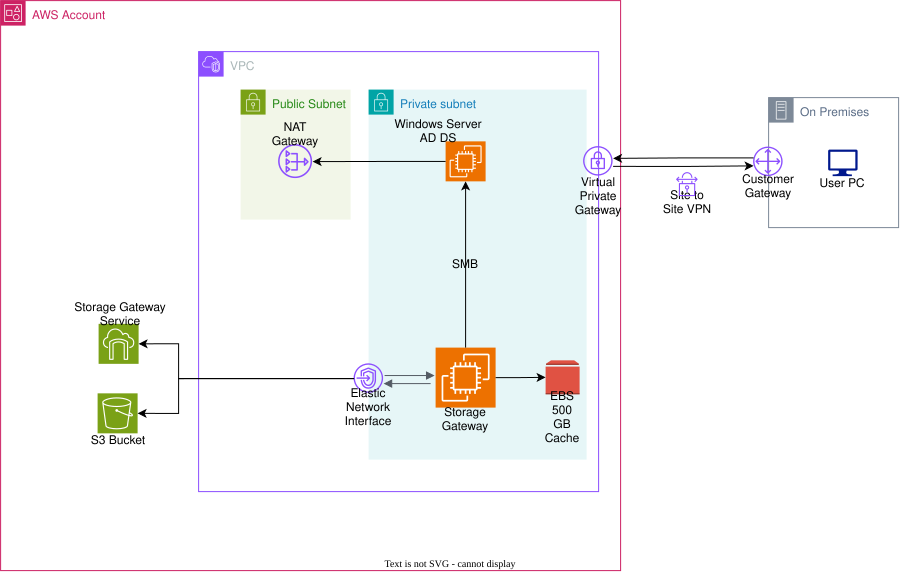

# AWS Hybrid Storage — S3 + Active Directory Integration

A **hybrid file server** implementation combining **Amazon S3** as the storage backend with **Windows Server (AD DS)** for login authentication, bridged by **AWS Storage Gateway (File Gateway)**, and accessible from on-premise/local computers via **Site-to-Site VPN**.



---

## 1. Background & Objective

The initial requirement for this project was to build a **file server** accessible both from the cloud and from a local (on-premise) network, with Active Directory-integrated authentication — replicating the experience of a traditional office SMB file share.

The first option evaluated was **Amazon FSx for Windows File Server**, since it natively supports SMB and AD integration without requiring additional components. However, after cost analysis, **FSx turned out to be significantly more expensive** for this use case, because:

- FSx charges for **provisioned storage** (not actual storage used), with a minimum capacity requirement per file system.
- **Throughput capacity** is billed separately and increases significantly as higher performance is needed.
- The **Multi-AZ** scheme (for HA) adds a substantial cost premium.
- It's well suited for enterprise workloads with high, consistent I/O, but becomes cost-inefficient for file storage use cases with low-to-moderate access patterns.

Since this project's needs lean more toward **archival/general-purpose file storage with low-to-medium access patterns** rather than I/O-intensive workloads, an **S3 + Storage Gateway** approach was chosen instead, based on the following considerations:

- **S3** bills based on actual storage consumed (pay-as-you-go), is significantly cheaper per GB than FSx, and can be further optimized with **lifecycle policies** (Standard → IA → Glacier).
- **Storage Gateway (File Gateway)** provides a local cache (EBS) for fast access to frequently used data, while "cold" data remains cheaply stored in S3.
- Login authentication can still be integrated through **Windows Server AD DS**, joined by Storage Gateway (SMB security: Active Directory authentication), preserving the familiar AD-based SMB file share experience for users.

In short: **this architecture was chosen purely for cost optimization reasons**, at the trade-off of slightly more complexity (requiring a Storage Gateway appliance + EBS cache) compared to FSx, which is plug-and-play but expensive.

---

## 2. Architecture

### Core Components

| Component | Function |
|---|---|
| **Windows Server (AD DS)** | Domain controller — handles user login authentication for the file share |
| **Storage Gateway (File Gateway)** | Data plane appliance — exposes the SMB share, maintains local cache, syncs to S3 |
| **EBS 500 GB (Cache)** | Local cache volume for Storage Gateway, holding frequently accessed data |
| **S3 Bucket** | Primary storage backend — durably and cheaply stores all file share data |
| **Storage Gateway Service (AWS managed)** | AWS control plane — manages activation, configuration, and orchestration of the appliance to S3 |
| **NAT Gateway** | Outbound internet access for Storage Gateway/Windows Server (updates, gateway activation) |
| **Virtual Private Gateway (VGW)** | VPN endpoint on the AWS side, where traffic from on-premise enters the VPC |
| **Site-to-Site VPN + Customer Gateway** | Connects the local network to the VPC privately, allowing the SMB share to be mounted from local computers |

### Traffic Flow

**Authentication & file access flow (from local computer):**
```
Local Computer → Site-to-Site VPN → Customer Gateway → Virtual Private Gateway
→ Route Table (private subnet) → Storage Gateway (SMB 445) ↔ Windows Server AD DS (authentication)
```

**Data flow to S3 (behind the scenes):**
```
Storage Gateway → Elastic Network Interface → Storage Gateway Service (control plane)
→ S3 Bucket (data plane, actual object storage)
```

**Outbound internet flow (separate from VPN):**
```
Storage Gateway / Windows Server → Private Subnet route table → NAT Gateway (public subnet) → Internet Gateway → Internet
```

> Note: NAT Gateway is **not** traversed by VPN traffic. VPN traffic enters through the VGW, which is attached directly to the VPC. NAT Gateway is used solely for outbound internet access (gateway activation, patching, etc.).

---

## 3. Cost Estimate

> The figures below are a **template** — adjust them to match your project's actual region, capacity, and usage patterns. For the most accurate and up-to-date numbers, use the [AWS Pricing Calculator](https://calculator.aws/).

### 3.1 Option Comparison: FSx vs S3 + Storage Gateway

| Item | Amazon FSx for Windows File Server | S3 + Storage Gateway (chosen) |
|---|---|---|
| Pricing model | Provisioned storage + throughput capacity (billed even if not fully used) | Pay-as-you-go based on actual storage used |
| Minimum storage | Minimum capacity required per file system | No minimum, granular per object |
| Throughput cost | Billed separately, increases quickly for higher performance | Determined by the Storage Gateway instance/appliance + EBS cache |
| Multi-AZ HA | Significant additional premium | S3 HA is built-in (11 nines durability); appliance HA requires extra effort |
| Cheap lifecycle/tiering | No automatic tiering to cheaper storage | Available — S3 Lifecycle (Standard → IA → Glacier) |
| Best suited for | High, consistent I/O workloads needing native SMB performance without a cache layer | Low-to-medium access workloads, cost efficiency as priority |

### 3.2 Monthly Cost Breakdown Template (Region: _____________)

| Component | Specification | Unit Cost (USD) | Qty/Usage | Estimated Monthly Cost (USD) |
|---|---|---|---|---|
| Windows Server EC2 (AD DS) | Instance type: _______ | | 730 hrs | |
| EBS Cache Volume (gp3) | 500 GB | | 500 GB | |
| Storage Gateway (File Gateway) | Appliance (EC2-based) | | 730 hrs | |
| S3 Standard Storage | Estimated total data | | ___ GB | |
| S3 Lifecycle (IA/Glacier) | Cold storage data | | ___ GB | |
| S3 Requests (PUT/GET) | Estimated requests/month | | | |
| NAT Gateway | Per hour + per GB processed | | 730 hrs + ___ GB | |
| Site-to-Site VPN | Per connection/hour | | 730 hrs | |
| Data Transfer Out | Estimated outbound transfer | | ___ GB | |
| Virtual Private Gateway | (usually included in VPN cost) | | | |
| **Total Estimated/Month** | | | | **$______** |

### 3.3 Comparison Reference (optional, to include as a README comparison)

| Scenario | Estimated Monthly Cost |
|---|---|
| FSx for Windows File Server (Single-AZ, equivalent capacity) | *fill in after checking AWS Pricing Calculator* |
| FSx for Windows File Server (Multi-AZ) | *fill in after checking AWS Pricing Calculator* |
| S3 + Storage Gateway (this architecture) | *fill in from table 3.2 above* |

> Fill in the figures above using the AWS Pricing Calculator based on your project's actual region and estimated capacity. If needed, I can help calculate a more detailed estimate once you provide the instance type, data capacity, and region used.

---

## 4. Production Considerations (Known Limitations)

This architecture was built for **portfolio/demo purposes with a focus on cost optimization**. For a stricter production deployment, the following should be considered further:

- **High Availability**: Windows Server AD DS and Storage Gateway are currently single instances each (single point of failure). For production, ideally deploy at least 2 Domain Controllers across 2 different AZs, or migrate to **AWS Managed Microsoft AD**.
- **Security**: Security Group/NACL rules should be restricted to allow only SMB (445), Kerberos (88), and LDAP (389) from the on-premise CIDR range — not broadly open.
- **Encryption**: enable EBS volume encryption and S3 server-side encryption (SSE-S3/SSE-KMS).
- **VPC Endpoint for Storage Gateway**: to keep appliance ↔ Storage Gateway Service traffic from traversing the NAT Gateway/internet, use an Interface VPC Endpoint (`com.amazonaws.<region>.storagegateway`) — more secure and reduces NAT Gateway data transfer costs.
- **Monitoring**: add CloudWatch alarms for Storage Gateway cache hit ratio & upload buffer, plus CloudTrail for S3 access auditing.
- **Backup & DR**: ensure a backup strategy is in place for the EBS cache volume and S3 versioning/replication according to data retention requirements.

---

## 5. Tech Stack

- Amazon S3
- AWS Storage Gateway (File Gateway)
- Amazon EC2 (Windows Server, AD DS)
- Amazon EBS (gp3)
- Amazon VPC (Public/Private Subnet, NAT Gateway)
- Site-to-Site VPN, Virtual Private Gateway, Customer Gateway

---

## 6. Project Structure (Terraform)

This project's Infrastructure-as-Code is built with Terraform, following **modular & reusable** principles and aligned with the pillars of the **AWS Well-Architected Framework**. Each architecture component is separated into its own module with no hardcoded values, and each environment (`dev`/`prod`) simply calls the same modules with different variables.

```
aws-hybrid-storage-s3-active-directory-integration/
│
├── README.md
├── .gitignore
├── .terraform-version
│
├── environments/                      # Root modules per environment (separate state)
│   ├── dev/
│   │   ├── main.tf                    # Calls modules/ with dev-specific variables
│   │   ├── variables.tf
│   │   ├── outputs.tf
│   │   ├── terraform.tfvars            # Dev-specific values (never commit sensitive values)
│   │   ├── backend.tf                  # Remote state (S3 + DynamoDB lock) — per env
│   │   └── providers.tf
│   │
│   └── prod/
│       ├── main.tf
│       ├── variables.tf
│       ├── outputs.tf
│       ├── terraform.tfvars
│       ├── backend.tf
│       └── providers.tf
│
├── modules/                            # Reusable modules — no hardcoded values
│   │
│   ├── networking/                     # VPC, subnets, route tables, IGW, NAT GW
│   │   ├── main.tf
│   │   ├── variables.tf
│   │   ├── outputs.tf
│   │   └── README.md
│   │
│   ├── vpn/                            # Site-to-Site VPN, VGW, Customer Gateway
│   │   ├── main.tf
│   │   ├── variables.tf
│   │   ├── outputs.tf
│   │   └── README.md
│   │
│   ├── active-directory/               # EC2 Windows Server + AD DS setup
│   │   ├── main.tf
│   │   ├── variables.tf
│   │   ├── outputs.tf
│   │   ├── user_data.tpl               # Bootstrap script for AD DS promotion
│   │   └── README.md
│   │
│   ├── storage-gateway/                # Storage Gateway appliance + EBS cache + ENI
│   │   ├── main.tf
│   │   ├── variables.tf
│   │   ├── outputs.tf
│   │   ├── user_data.tpl
│   │   └── README.md
│   │
│   ├── s3-backend/                     # S3 bucket + lifecycle policy + encryption + versioning
│   │   ├── main.tf
│   │   ├── variables.tf
│   │   ├── outputs.tf
│   │   └── README.md
│   │
│   ├── vpc-endpoints/                  # Interface VPC Endpoint for Storage Gateway (cost/security)
│   │   ├── main.tf
│   │   ├── variables.tf
│   │   ├── outputs.tf
│   │   └── README.md
│   │
│   ├── security/                       # Security Group, NACL, KMS key
│   │   ├── main.tf
│   │   ├── variables.tf
│   │   ├── outputs.tf
│   │   └── README.md
│   │
│   ├── iam/                            # IAM roles & policies (least privilege)
│   │   ├── main.tf
│   │   ├── variables.tf
│   │   ├── outputs.tf
│   │   └── README.md
│   │
│   └── monitoring/                     # CloudWatch alarms, dashboards, CloudTrail
│       ├── main.tf
│       ├── variables.tf
│       ├── outputs.tf
│       └── README.md
│
├── policies/                           # Standalone IAM policy JSON (for complex policies)
│   ├── storage-gateway-s3-policy.json
│   └── ad-ec2-policy.json
│
├── scripts/                            # Helper scripts (validation, bootstrap, cost estimate)
│   └── validate.sh
│
├── docs/
│   ├── architecture-decision-records/  # ADR — documents *why* S3+SGW was chosen over FSx, etc.
│   │   └── 0001-choose-s3-storage-gateway-over-fsx.md
│   ├── image/
│   │   └── s3-hybrid-file-servers.drawio.svg
│   └── cost-estimate.md                # From the README section above
│
└── tests/                              # (optional) Terratest or terraform test
    └── networking_test.go
```

**Why this structure was chosen (aligned with the Well-Architected Framework):**

| Pillar | How it's addressed |
|---|---|
| **Operational Excellence** | Separate `environments/` for dev/prod with isolated state; ADRs in `docs/` document architecture decisions; every module has its own `README.md` |
| **Security** | Dedicated `security/` and `iam/` modules — least privilege, explicit SG/NACL, KMS for encryption at rest |
| **Reliability** | Separate module per component makes it easy to add Multi-AZ AD DS or a redundant Storage Gateway without major refactoring |
| **Performance Efficiency** | `vpc-endpoints/` module reduces latency and hops through the NAT Gateway |
| **Cost Optimization** | `s3-backend/` module has built-in lifecycle policy; `docs/cost-estimate.md` acts as a living document; `vpc-endpoints/` reduces data transfer cost |

---

## 7. How to Use (Deployment Guide)

### 7.1 Prerequisites

- [Terraform](https://developer.hashicorp.com/terraform/downloads) matching the version pinned in `.terraform-version`
- AWS CLI configured (`aws configure`) with credentials that have sufficient permissions (IAM user/role for VPC, EC2, S3, Storage Gateway, VPN)
- An S3 bucket + DynamoDB table already created beforehand for remote state (create these manually once, outside of this Terraform config, since a backend can't provision itself)
- Access to the on-premise router/firewall to configure the Customer Gateway (on-premise public IP, pre-shared key)

### 7.2 Deployment Steps

1. **Clone the repository and navigate to the target environment folder**
   ```bash
   git clone <repo-url>
   cd aws-hybrid-storage-s3-active-directory-integration/environments/dev
   ```

2. **Fill in variables** in `terraform.tfvars` (region, VPC CIDR, instance type, on-premise CIDR, Customer Gateway IP, etc.). Never commit sensitive values (AD password, VPN PSK) — use AWS Secrets Manager/SSM Parameter Store and reference them via a data source, or pass them as `TF_VAR_*` environment variables.

3. **Initialize Terraform** (downloads providers & configures the remote state backend)
   ```bash
   terraform init
   ```

4. **Review the infrastructure change plan**
   ```bash
   terraform plan -out=tfplan
   ```
   Review the output carefully, especially resource ordering (VPC → subnets → NAT/VGW → EC2/Storage Gateway) since there are cross-module dependencies.

5. **Apply the infrastructure**
   ```bash
   terraform apply tfplan
   ```

6. **Activate the Storage Gateway** (a manual/semi-manual step, not fully achievable through Terraform)
   - Once the Storage Gateway appliance EC2 instance is running, open the AWS Console → Storage Gateway → Activate gateway using the appliance's private IP (since it's accessed from within the VPC).
   - Set up the file share, point it to the S3 bucket created by the `s3-backend` module, enable **SMB security: Active Directory authentication**, and join it to the already-live AD DS domain.

7. **Configure the Customer Gateway on the on-premise side**
   - Retrieve the VPN configuration (tunnel IPs, PSK) from the `vpn` module's Terraform output (`terraform output`), then enter it into the on-premise router/firewall according to your vendor (Cisco, MikroTik, FortiGate, etc.).

8. **Verify end-to-end**
   - From the local computer, mount the SMB share via the Storage Gateway's private IP (through the VPN): `\\<storage-gateway-private-ip>\<share-name>` (Windows) or `mount -t cifs` (Linux/Mac).
   - Log in using AD DS credentials, and confirm that uploaded files are actually syncing to the S3 bucket.

9. **Destroy (if you need to tear down an environment)**
   ```bash
   terraform destroy
   ```
   Pay attention to destroy ordering — cross-module dependencies mean the VPN/VPC should be destroyed last, after the resources that depend on them.

### 7.3 Deploying to Other Environments

Since all modules are reusable, deploying to `prod` simply means repeating the same steps in the `environments/prod` folder with a different `terraform.tfvars` (CIDR, larger instance sizes, Multi-AZ enabled, etc.) — no need to duplicate module code.

---

## 8. How It Works

Once the infrastructure is deployed, here's the end-to-end system workflow:

1. **Network provisioning** — the `networking` module creates the VPC, public & private subnets, route tables, Internet Gateway, and NAT Gateway. The `vpn` module creates the VGW attached to the VPC and a Customer Gateway representing the on-premise router.

2. **Identity layer provisioning** — the `active-directory` module launches an EC2 Windows Server instance, bootstrapped via `user_data.tpl` to install the AD DS role and promote it to a domain controller.

3. **Storage layer provisioning** — the `s3-backend` module creates the S3 bucket with encryption, versioning, and lifecycle policy. The `storage-gateway` module launches the Storage Gateway appliance EC2 instance with an attached EBS cache volume and an ENI in the private subnet.

4. **Appliance activation & configuration** (manual step) — the Storage Gateway appliance "checks in" with the AWS Storage Gateway Service (control plane) for activation, and is then configured so its SMB file share connects to the S3 bucket and joins the AD DS domain.

5. **On-premise connection** — once the on-premise Customer Gateway is configured with details from the `vpn` module, an IPsec tunnel is established between on-premise and the VGW. Traffic between the local computer and the VPC (in both directions) flows through this tunnel, routed by the private subnet's route table.

6. **Day-to-day user access** — users on local computers mount the SMB share as if accessing a regular office file server. On each request, Storage Gateway validates authentication against Windows Server AD DS, then serves the file from the EBS cache (if present) or retrieves it from S3 (if not yet cached).

7. **Sync & cost optimization run automatically** — files uploaded/modified in the EBS cache are synced to S3 in the background by Storage Gateway. The S3 Lifecycle Policy (`s3-backend` module) automatically moves infrequently accessed data to cheaper storage classes (S3-IA → Glacier) without manual intervention.

8. **Monitoring runs passively** — the `monitoring` module collects CloudWatch metrics (cache hit ratio, upload buffer, etc.) and CloudTrail logs, so the team can track system health and cost trends over time.

---

## 9. Roadmap / Next Steps

- [ ] Implement VPC Endpoint for Storage Gateway
- [ ] Add S3 Lifecycle Policy
- [ ] Set up Multi-AZ / redundant Domain Controller
- [ ] Add CloudWatch monitoring + dashboard
- [ ] Step-by-step deployment documentation (Terraform/CloudFormation)
